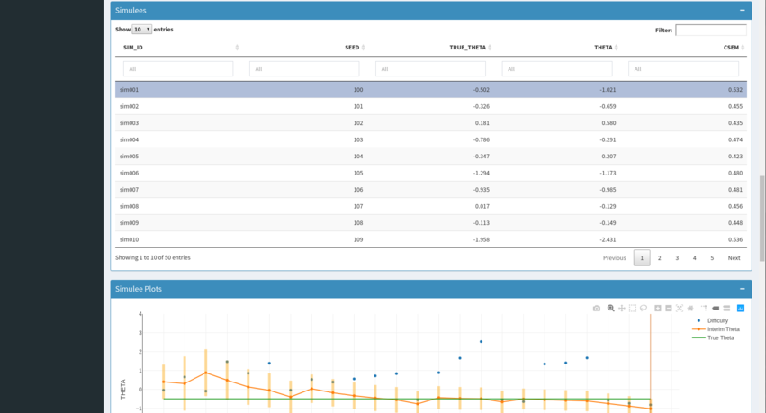
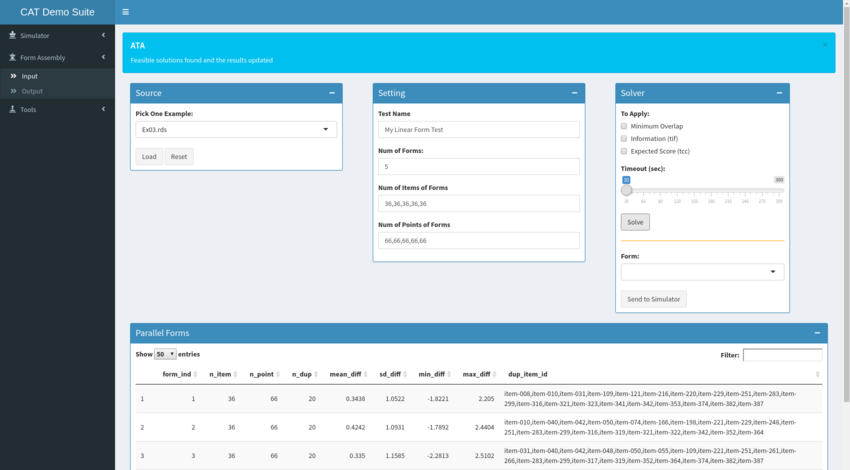
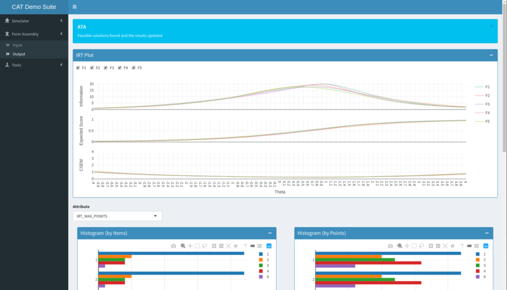

# catsuite

catsuite runs and visualizes CAT simulations, and creates linear or parallel forms.

Copyright (C) 2016-2020 Yuehmei Chien

This program is free software: you can redistribute it and/or modify
it under the terms of the GNU Affero General Public License as published
by the Free Software Foundation, either version 3 of the License, or
(at your option) any later version.

This program is distributed in the hope that it will be useful,
but WITHOUT ANY WARRANTY; without even the implied warranty of
MERCHANTABILITY or FITNESS FOR A PARTICULAR PURPOSE.  See the
GNU Affero General Public License for more details.

# Usage

See the `Installation` section below for instructions on how to install catsuite.

Once installed, use the R console to launch catsuite
```R
> shiny::runApp(system.file("app", package = "catsuite"))
```

## Simulator

On the left sidebar, select the `Input` screen from the `Simulator` menu.  In the `Simulation Input` box, select an example from the `Load Example` drop-down and click the `Load` button.


Review the simulator configuration in the `Simulee` and `Test Config` boxes, and then click the `Run` button.  Once the simulation has finished running, you will be taken automatically to the `Output` screen in the `Simulator` menu.


On the output screen, scroll down to review the tables and plots visualizing the simulated outcomes.  In the `Simulees` table, select individual simulees to review the specific details for that individual.



## Form Assembly

On the left sidebar, select the `Input` screen from the `Form Assembly` menu.  In the `Source` box, select an example from the `Pick Example` drop-down and click the `Load` button.


Review the assembly configuration in the `Setting` and `Solver` boxes, and then click the `Solve` button.  Once the assembly has finished running, you the generated forms will be visible in the table below.



On the left sidebar, select the `Output` screen from the `Form Assembly` menu.  Scroll down to review the tables and plots visualizing the assembled forms.



# Installation

## Installing R and RStudio

catsuite requires `R` and `RStudio` to run.  It's also helpful if the `devtools` and `tidyverse` R packages are already installed.  If you already have these, skip to the next section.

- Download and install `R`: https://www.r-project.org/
- (optional) Download and install `RStudio`: https://rstudio.com/products/rstudio/download/
  - catsuite works with any version of RStudio, including the free open source license
- Use the R console to install the `devtools` and `tidyverse` R packages
```
> install.packages(c("devtools", "tidyverse"))
```

## Installing Solvers

catsuite requires the `CBC` and `GLPK` solvers to run.  First install the solvers, and then the `clpAPI` and `glpkAPI` R packages that connect to them.

- Download and install `CBC`: https://github.com/coin-or/Cbc#download
  - On Mac/Homebrew install: `coin-or-tools/coinor/cbc` `coin-or-tools/coinor/clp`
  - On Linux/Debian/Deb install: `coinor-libclp-dev` `coinor-cbc` `coinor-clp`
  - On Linux/RedHat/Rpm install: `coin-or-Cbc` `coin-or-Clp`
- Download and install `GLPK`: http://www.gnu.org/software/glpk/#TOCdownloading
  - On Mac/Homebrew install: `glpk`
  - On Linux/Debian/Deb install: `libglpk-dev` `glpk-utils`
  - On Linux/RedHat/Rpm install: `libglpk-devel` `glpk`
- Use the R console to install the `clpAPI`, `glpkAPI` and `lpSolveAPI` R packages
```R
> install.packages(c("clpAPI", "glpkAPI", "lpSolveAPI"))
```

## Installing catsuite

catsuite is divided into four packages.  Use the R console to install each package.

```R
> devtools::install_github("yuehmeir2/myFormAssembler")
> devtools::install_github("yuehmeir2/CATSimulator")
> devtools::install_github("yuehmeir2/CATShinyModules")
> devtools::install_github("yuehmeir2/catsuite")
```

Once everything installed, launch catsuite using the following console command.
```R
> shiny::runApp(system.file("app", package = "catsuite"))
```

# Acknowledgements

Thank you to the many developers of R, RStudio, shiny, tidyverse, clpAPI, glpkAPI, plotly, and so many other packages.
